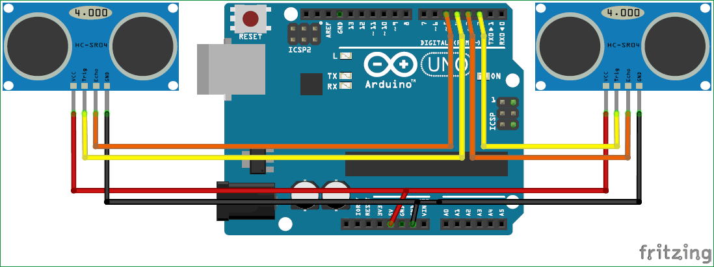

# Home-Cinema-Arduino
O aplicatie care presupune controlul unui video player prin gesturi reperate de 2 senzori ultrasonici.
De asemenea,proiectul contine un senzor de temperatura si un motor dc ce se activeaza in momentul in care temperatura din camera este peste 20 de grade celsius

## Schema proiectului

## Cerinte
  ***Hardware***
- Placa Arduino Uno
- 2 Senzori Ultrasonici
- Motor Dc
- Senzor de temperatura LM35
- Tranzistor NPN 3904
- Dioda
- Rezistenta 1K

***Software***
 - Arduino
 - Python 2.7

## Manual utilizator
Pentru rularea proiectului sunt necesare urmatoarele:
- Instalare Arduino
- Instalare Python 2.7
- Instalare pyautogui
- Se ruleaza fisierul sketch_dec12a.ino in Arduino
- Intr-un terminal se ruleaza scriptul connection.py
- Se porneste o aplicatie de video player
- Pentru setarea volumului se plaseaza mana in fata senzorului stang pana la o apropiere din intervalul 0-10 pentru creste volum si intervalul 20 - 40 pentru scadere volum.
- Play/Pause : se plaseaza ambele maini in apropierea unui senzor pentru valori din intervalul 20-30 pentru a porni sau opri video-ul
- Forward/Rewind: pentru o distanta mai mica de 10 cm detectata de senzorul drept se aplica "rewind", iar pentru o valoare intre 20 - 40 se trimite comanda "forward".

## Referinte
- https://circuitdigest.com/microcontroller-projects/control-your-computer-with-hand-gestures?fbclid=IwAR2mmuQcxpIElbxo3f7lmsV3eEoO05pExZvPhDlwophD1Y1G6JxdkWfdTS0

- https://howtomechatronics.com/tutorials/arduino/ultrasonic-sensor-hc-sr04/?fbclid=IwAR2r2BhuKzvxqrSh8GEyMyUBjBe6_hV43qXwsZ7lobpaifCmTp1sRQUMqtU

- https://www.hackster.io/Jasleen1429/temperature-sensor-to-control-servo-motor-b770f9?fbclid=IwAR0yckyKGItCnntnO8OBkNUNgYu-MCLRkHAzUa7nNYbNyJr4U1NeGPuubI8#things
